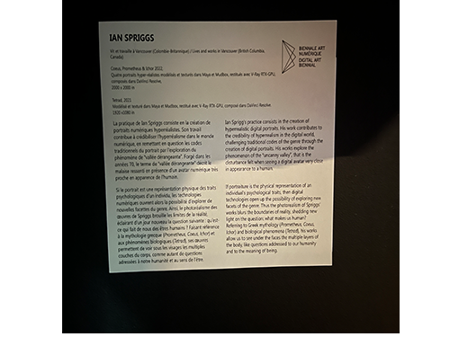
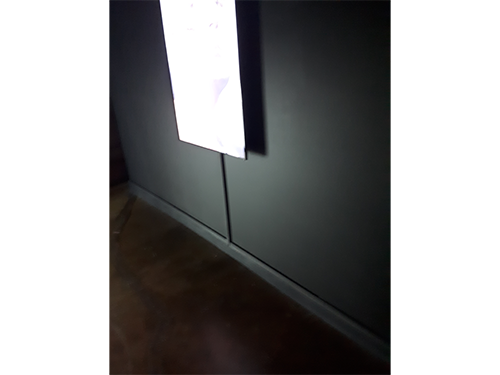

# Bian 6: Mutation

## Arsenal

## Type d'exposotion: itinerante

## Tetrad, Coeus, Prometeus, Ichor

.

### Ian Springs
### 2022

Photo prise par Martin Soltan

Modelisation de portrait hyperrealiste realiste 3d fait a partire de maya, pour remetreen questions les codes du ortrait traditionell.

### Type d'instalation: contemplative

.

### Mise en espace: 
.

Les ecran sont sur on fond noire dans un grande piece avec d'autres exposition et n'est as separer.

### Element nessesaire: Fils et cache fils, ecran.

example de fils cacher

### experiance vecue:
Les spectateur peuvent reguarder les portrait un a un en s'aprochant de ceux-ci ou ce reculer et contempler une vue d'ensemble de l'oeuvre.

### ce qui ma plu:
Je suis interresser par la modelisation 3d et le realisme en generale. Je me suis demander en reguardant l'oeuvre qu'elle logiciel ou moyen l'artiste a utiliser. J'ais aussi ete impressioner par la qualiter de l'oeuvre et sa fluiditer. L'oeuver ma inspirer par sa fluiditer et les petit details qu'elle contenait, je vais surement retenir certains de ces pettite chose lors de notre cours de 3d.

### element que je souhate retenir:
Lors de notre cours de 3d je veut pouvoir retenir la fluiditer des movement de l'oeuvre et les petit details qu'elle contenait. Par example la paux des personnage qui semble a du vent et qui s'attache ou ce detache des visage. Un autre example, mais pour les petit details cerait les veine qui peut etre observer sur l'homme.
