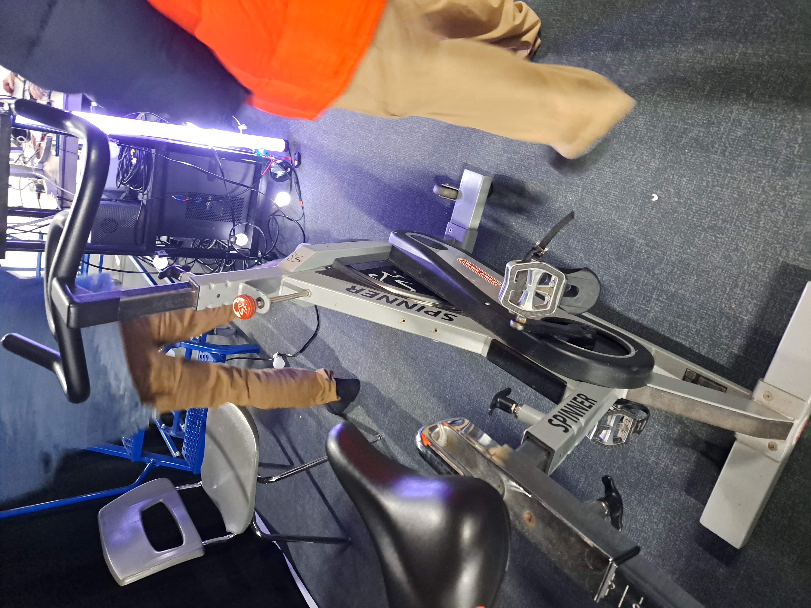
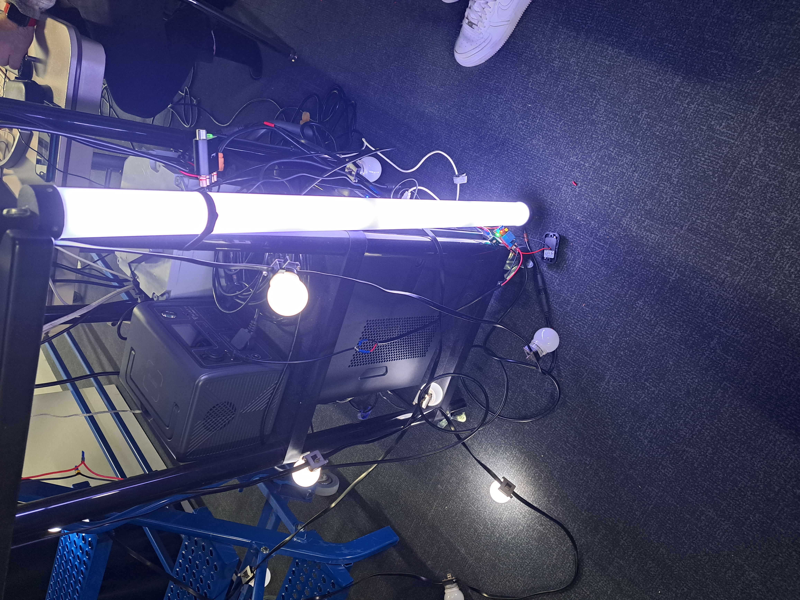
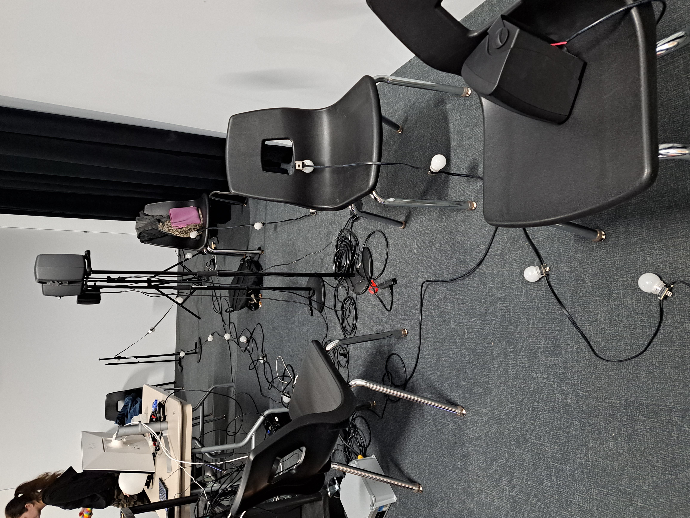
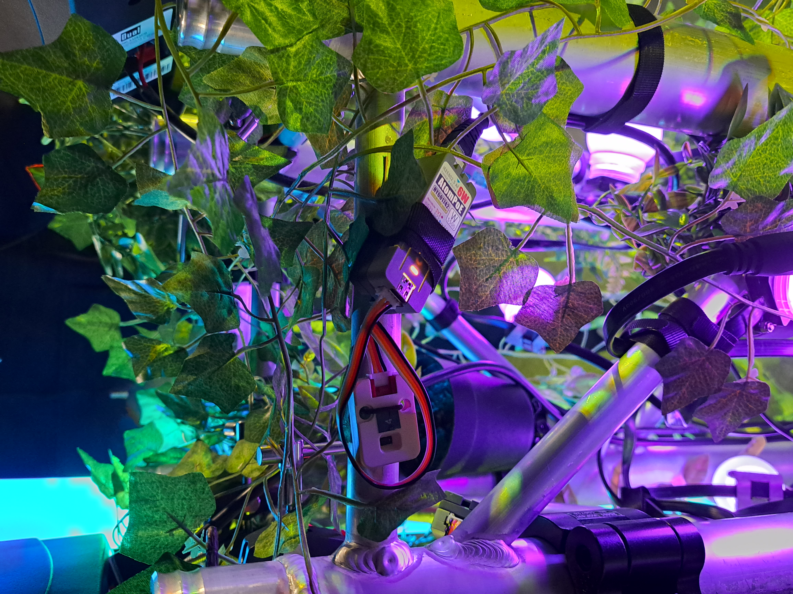

# Mycelium (exploration)
## Oeuvres
- EDRIA (par Elwin Durand, Loic Delorme, Dominic Roberts, Gabriel Leblanc, Meryem Berbiche et Jean-Christophe)
- Luma Sol (par Éloïse Gagné, Skayla Stimphil, Michaël Simard et Pénélope Morrisson)
- Nexum (par Sébastien Reilly, Sabrina Laforest, Alexandre Daniel et Maxime Des Lauriers)
- Echomarine (par Florence Lapierre, Natacha Abdallah, Tracy Gua et Maria Laura Coronel)
- Zodie-Gal (par Abdanor Yara)

## Lien avec le thème de Mycélium
### EDRIA
faire une demonstration de la fin de l'industrialisation et le retour a la nature.  https://tim-montmorency.com/2023/projets/EDRIA/docs/web/index.html

### Luma Sol
Il est crucial pour les êtres humains de maintenir une connexion avec la nature, particulièrement compte tenu de l'urgence climatique actuelle. En pédalant, nous avons la capacité d'agir de manière positive sur l'environnement, ce qui souligne l'importance de prendre des mesures concrètes pour protéger notre planète.  https://tim-montmorency.com/2023/projets/LumaSol/docs/web/index.html

### Nexum
Ce parcours offre une expérience immersive qui favorise la connexion entre les êtres humains et la nature.  https://tim-montmorency.com/2023/projets/Nexum/docs/web/index.html

### Echomarine
Sensibiliser les interacteurs aux conditions des animaux marin en dangers ou en vois de disparition. https://tim-montmorency.com/2023/projets/Echomarine/docs/web/index.html

### Zodie-Gal
Ce projet demontre le combat que certaine jeune filles ont avec eux meme. https://tim-montmorency.com/2023/projets/Zodie-Gal/docs/web/index.html

## Installations des projets en cours
### EDRIA

- 4 trépied avec haut parleur et projecteur autour du pillier central.
- un pillier central avec capteur de mouvement.
- des fausse plantes sur le pillier centrale

### Luma Sol

- Vélo stationnaire
- Escaliers avec guirlande lumineuse
- Haut-parleurs

### Nexum

- Haut-parleurs
- chaise avec guirlande lumineuse

### Echomarine 

(photo de Michaël Un Dupré)

- projecteur
- ordianteur qui controle les animations

### Zodie-Gal 

aucune information disponible au moment de la visite

## Les 3 cours incontournables pour réaliser ces projets

- Programmation interactive
- Audio
- integration web

## Technique que je n'ais pas trop compris

### commment un capteur de mouvement fonctionnenet?

Le détecteur de mouvement est composé d'un capteur de mouvement infrarouge. Ce capteur peut analyser la chaleur produite par n'importe quel mammifère. La chaleur qui émane d'un individu produit des infrarouges. C'est grâce à ce rayonnement infrarouge que le capteur peut détecter la présence de personnes. Explication de Nexecur: https://www.nexecur.fr/detecteur-de-mouvement-infrarouge-comment-fonctionne#:~:text=Le%20détecteur%20de%20mouvement%20est,détecter%20la%20présence%20d%27intrus.

## Classement des projets et attente pour le résultat final 

### 1-EDRIA

Je choisis ce projet en premier, car c'est celui qui a attirer le plus mon attentions et je crois que l'envergure de leur projet est très grande, et jai hate de voir le résultat final.

### 2-Luma Sol

Je choisit ce projet en deuxième, car j'aime bien l'idée du vélo qui allume les lumières dans l'arbre, et pourrat aussi charger un téléphone en même temps. Par exemple, je doute qu'ils seront cappable de tout faire dans les délais, car ils semble déjat dans le jut.

### 3-Echomarine

Je choisit ce projet en troisième, car j'aime bien l'immersion que ce projet tente a crée, mais je le trouve peut interactif, j'espère que dans le projet final l'équipe réusirat a crée une plus grande interaction.

### 4-Nexum

Je choisit ce projet en quatrième position, car j'ai de la difficulter a voire ou ce projet vat aboutire, et je le trouve moins impressionnant que les autres projet. Je mattend a que ce projet me surprand, et qu'il crée une plus grande interaction qu je pensent quelle vas crée.

### Zodie-Gal 

J'ais choisis ce projet en derniée, car je ne voit premièrement pas le rapport avec le theme mycelium et je n'as pas pu beaucoup le voir.
