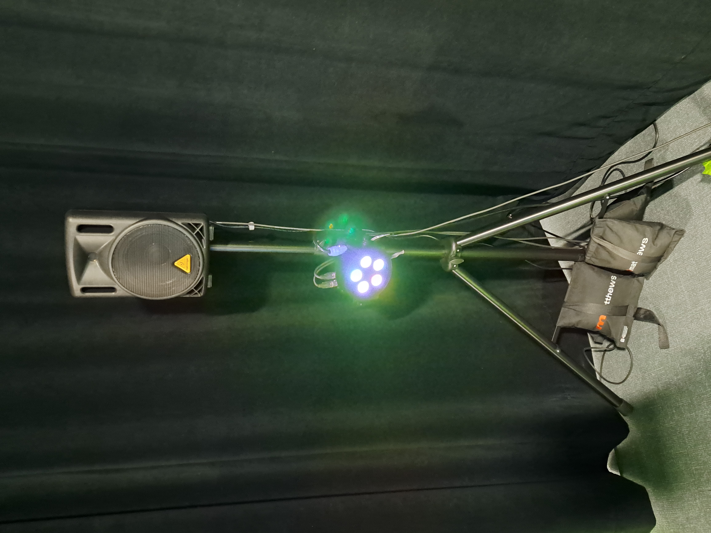

# Mycelium (exploration)
## Oeuvres
- EDRIA (par Elwin Durand, Loic Delorme, Dominic Roberts, Gabriel Leblanc, Meryem Berbiche et Jean-Christophe)
- Luma Sol (par Éloïse Gagné, Skayla Stimphil, Michaël Simard et Pénélope Morrisson)
- Nexum (par Sébastien Reilly, Sabrina Laforest, Alexandre Daniel et Maxime Des Lauriers)
- Echomarine (par Florence Lapierre, Natacha Abdallah, Tracy Gua et Maria Laura Coronel)
- Zodie-Gal (par Abdanor Yara)

## Lien avec le thème de Mycélium
### EDRIA
faire une demonstration de la fin de l'industrialisation et le retour a la nature.  https://tim-montmorency.com/2023/projets/EDRIA/docs/web/index.html

### Luma Sol
Il est crucial pour les êtres humains de maintenir une connexion avec la nature, particulièrement compte tenu de l'urgence climatique actuelle. En pédalant, nous avons la capacité d'agir de manière positive sur l'environnement, ce qui souligne l'importance de prendre des mesures concrètes pour protéger notre planète.  https://tim-montmorency.com/2023/projets/LumaSol/docs/web/index.html

### Nexum
Ce parcours offre une expérience immersive qui favorise la connexion entre les êtres humains et la nature.  https://tim-montmorency.com/2023/projets/Nexum/docs/web/index.html

### Echomarine
Sensibiliser les interacteurs aux conditions des animaux marin en dangers ou en vois de disparition. https://tim-montmorency.com/2023/projets/Echomarine/docs/web/index.html

### Zodie-Gal
Ce projet demontre le combat que certaine jeune filles ont avec eux meme. https://tim-montmorency.com/2023/projets/Zodie-Gal/docs/web/index.html

## Installations des projets en cours
###EDRIA

