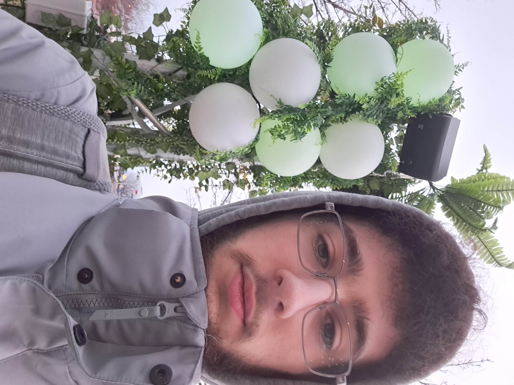

# Mycélium

## Lieux et dates d'expositions
20 au 23 mars dans les espaces publics extérieurs du collège – devant la porte 1 – ainsi que dans les studios C-1710-12

## Type d'exposition
exposition extérieur temporaire

## date de visite
23 mars 2023

## Nom des artistes
- Elwin Durand
- Loic Delorme
- Dominic Roberts
- Gabriel Leblanc
- Meryem Berbiche
- Jean-Christophe

## Année de réalisation
2023

## Description de l'oeuvre
Un pillier centrale qui sillumine de façon differente celon ci des personne sont devant les quatre coté du pillier. Il y a aussi des pilier tout atours du pillier centrale qui font du son et de la lumière.

##
