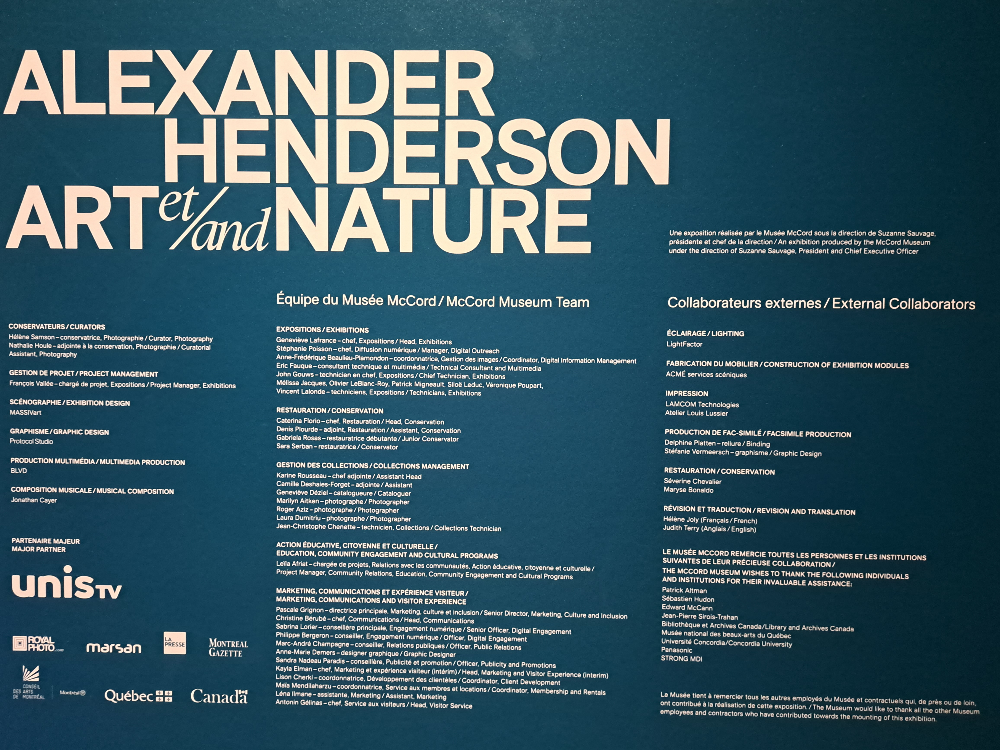
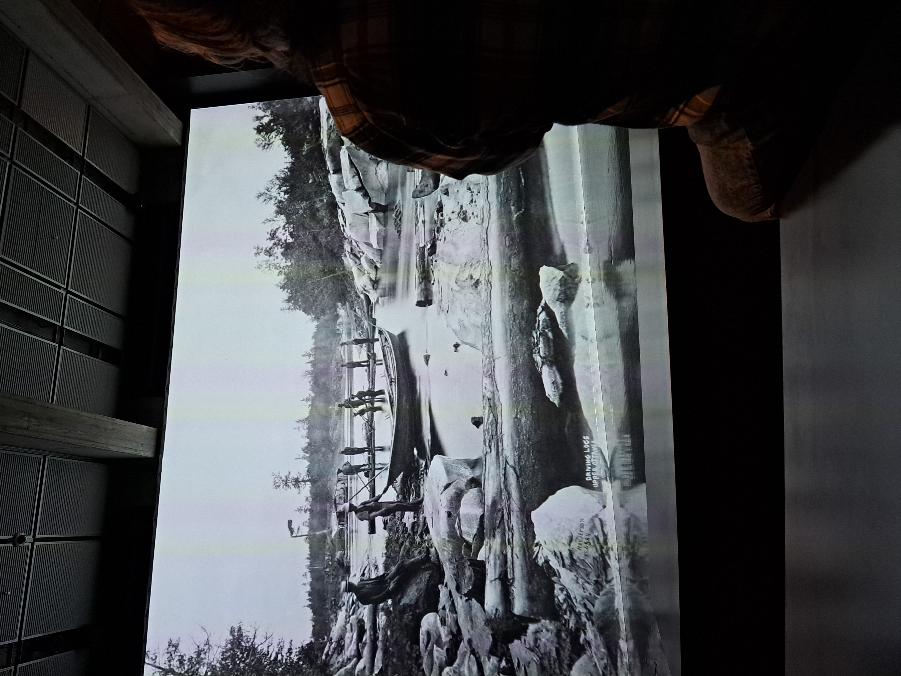
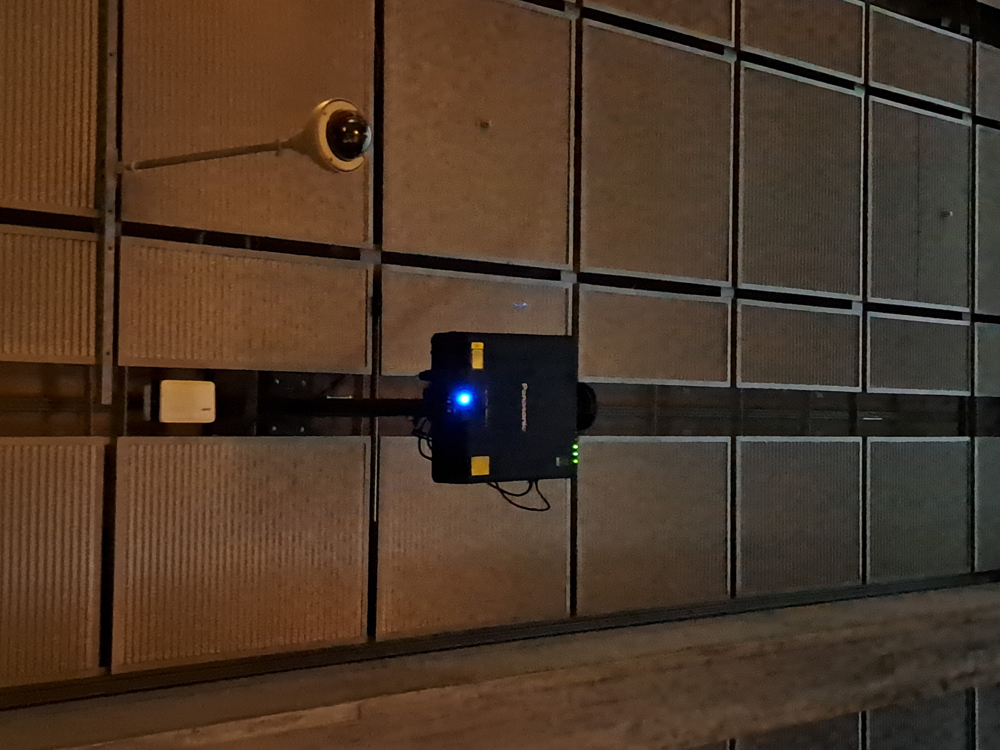
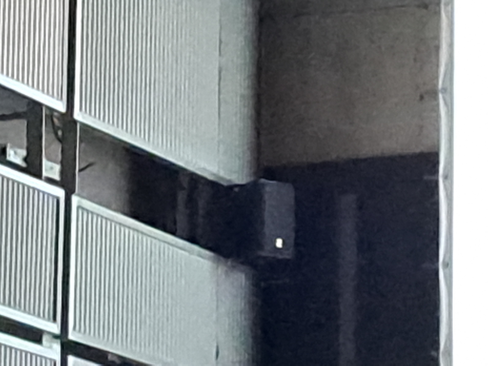

# Musée McCord Stewart

image de wikipedia

## ALEXANDER HENDERSON — ART ET NATURE

## Lieux d'exposition
690 Sherbrooke St W, Montreal, Quebec H3A 1E9

## Type d'exposition
exposition intérieur temporaire

## date de visite
18 avril 2023 

## vue d'ensemble de l'exposition
vidéo de la chaine Youtube du musée McCord Stuwart: www.youtube.com/watch?v=pg24OrdHxE4&t=38s

## Description et fonction du dispositif
A la fin de l'expostion il y a une immance projecteur qui mettent en grand plans les clicher quis on été présenter tout au long de l'exposition. Ce projcteur est différent du premier projecteur rencontrer, car premièreme, il est imansément plus gros, mais la plupart des clicher quis sont présenter par le gros projecteur son animer ce qui apporte une nouvelle dimansion sur l'exposition.

## Compsantes et techniques

il y a un projecteur qui permet de voir les clicher sur la grande surface

il y a des speakers qui permet de jouer une music calme et crée un ambiance relaxante

## Experiance vécue
La grande projection est placer dans une grande salle a la fin de l'exposition et permet de revoire plusieurs des clichée quis ont été présenter tout au long de l'exposition et permet d'avoire une vision différente de l'exposition avec un ajout d'un peu d'animation.

## Ce qui ma plu
L'expériance que j'ais vécue tout au long de l'exposition été vraiment bonne, car avec moi il y avait mon père qui a vécu près de où certains cliché on été pris et il a donc pus m'en parler ce qui a été une bonne expériance, mais aussi j'ais bien aimer voir la différence entre Montréal d'aujourd'hui et Montréal de l'époque. Le moment que j'ais le plus apprécier durant tout l'expostion est le dernier corridor ou mes photo préférer ont été exposer.

photo de la collection du musée McCord Stuwart: https://collections.musee-mccord-stewart.ca/en/objects/106706/etude-de-givre-parc-du-montroyal-montreal-qc-1877
