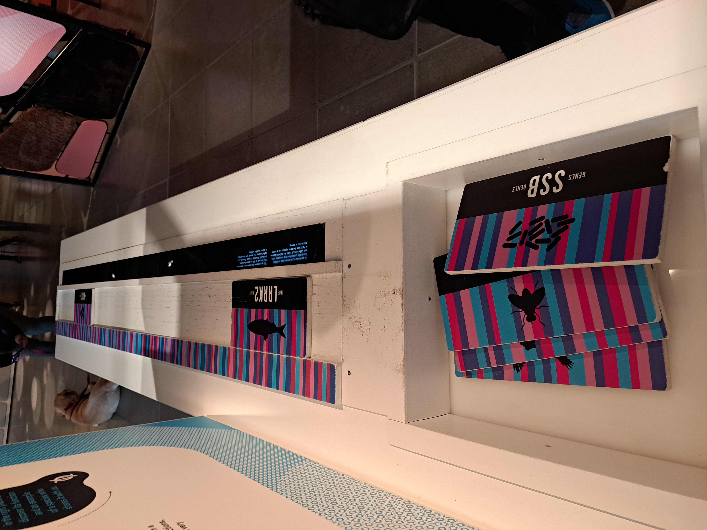
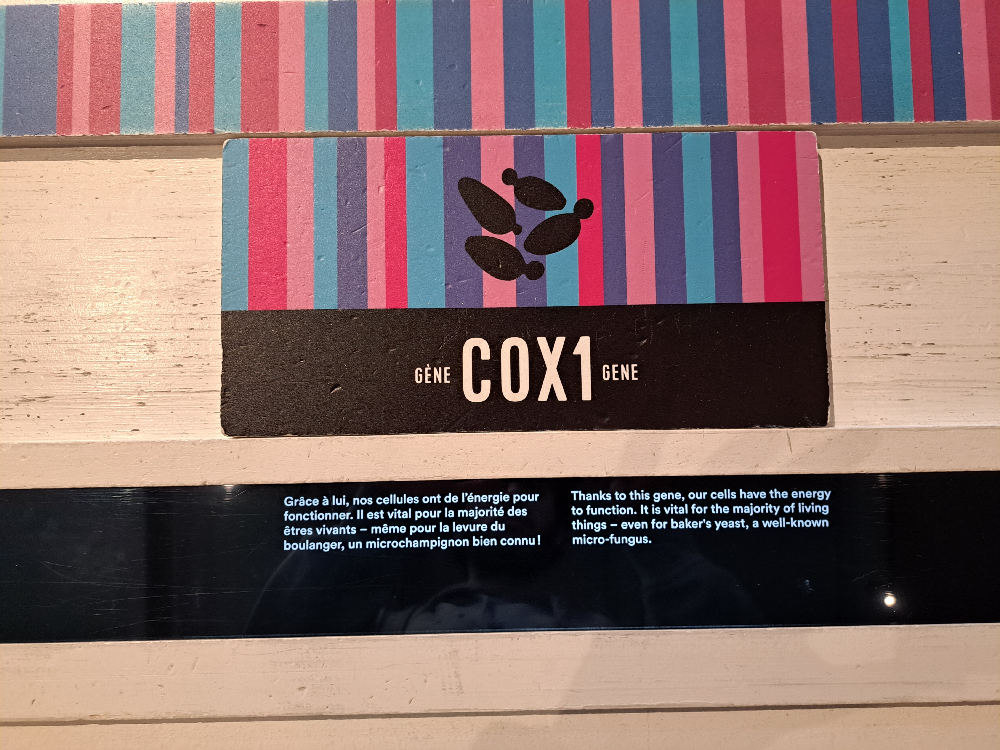
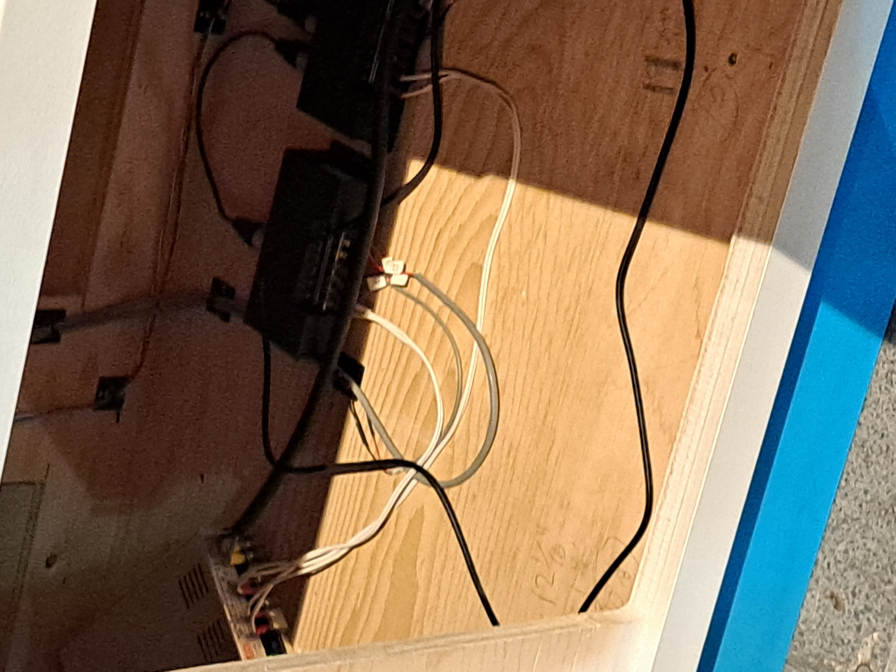

# Centre des sciences

## Lieux d'exposition
2 De la Commune St W, Montreal, Quebec H2Y 4B2

## Type d'exposition
exposition intérieur permanente

## date de visite
12 avril 2023

## Nom des artistes
équipe de multimedia du centre des science de Montréal

## Année de réalisation
plus ou moin 2015

## Description de l'oeuvre
une longue table avec des plaquetes un un écran permetant d'arranger les plaquetes en ordre et un message apparait sur l'écran quand une plaquete est mise au bon endroit

## Type d'instalation
interactive éducative

## Fonction des dispositifs
plusieur capteurs sont placer sous la table et dans les plaquette ce qui permet a l'écran de les détecter et d'afficher un pettit message.

## Compsantes et techniques
Plusieurs élément font en sorte que cette oeuvre puisse fonctioner comme un controleur des capteurs un long écran et des palquette munis de capteurs.

## Expérience vécue
Les visiteurs son présenter a une table vide et des plaquette sur le coté de celle ci et il est demander d'eux de placer les plaquette en orde sur cette table, lorsqu'il réusisent a placer ces plaquette sur la table un cour text explicatif apparait.

## Ce qui m'a plu 
J'ai beacoup aimer avoir la possibiliter de voir ce qui ce cachait derière le dispositif même si touts les visiteurs n'auront pas la même chance. J'ais aussi aimer le coter éducatif du dispositife et j'ais aussi aimer voir a qu'elle point le dispositif semble durable, car après pluseurs année le dispositif semble fonctionner sans aucun problème.

## Ce que j'aurais fait différament
Je n'aurait pas fait le plaquette en bois, car elle semble un peut cheap et lors de l'exposition elle semblait plutot maganer, jaurais donc plutot crée des plaquette en métal ou peut être d'un bois plus résistant.
